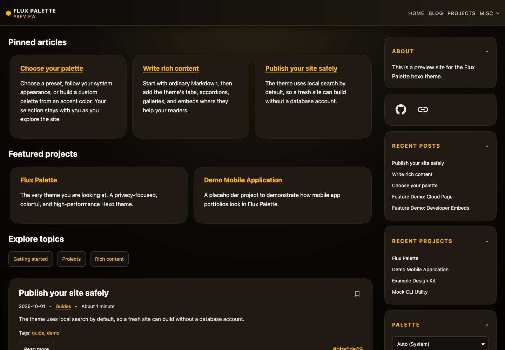
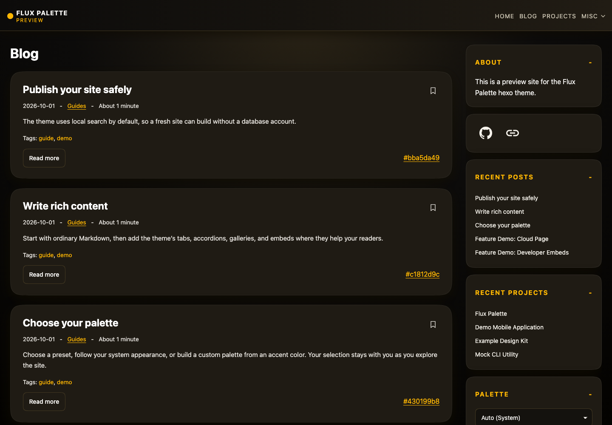
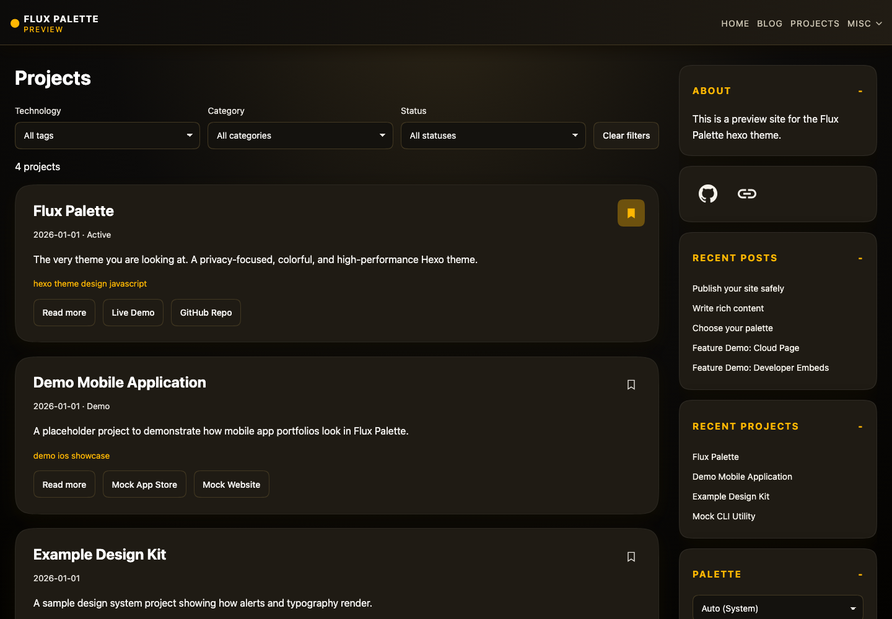
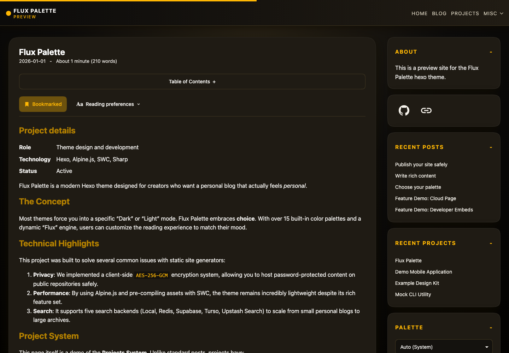
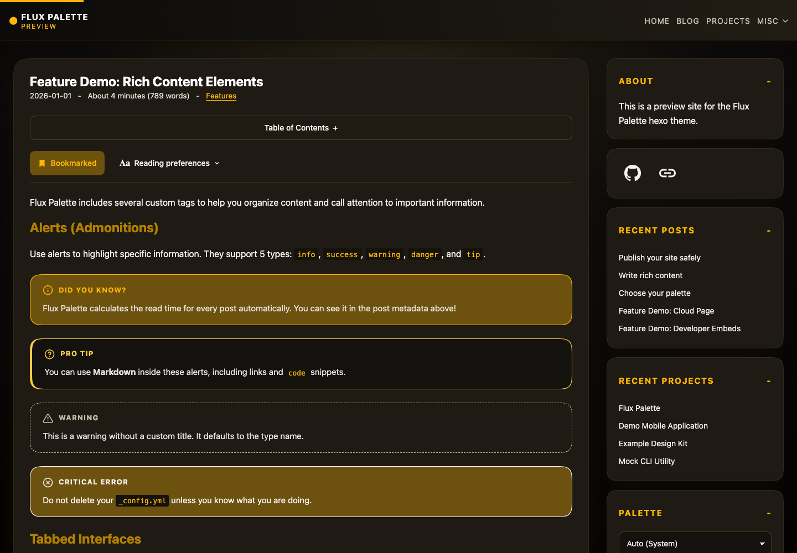
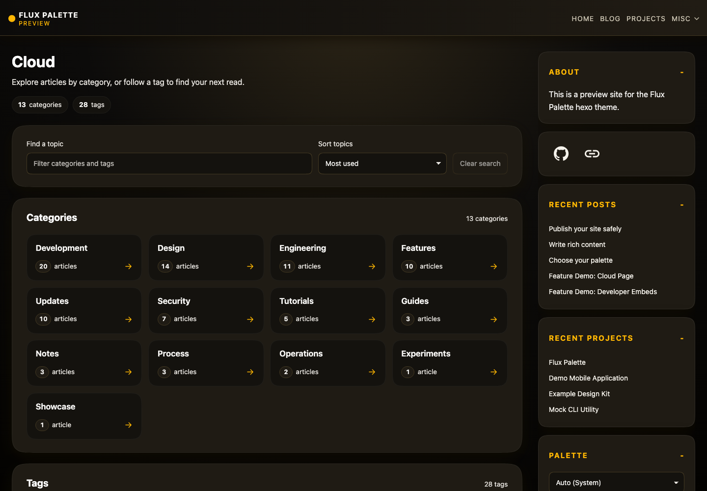
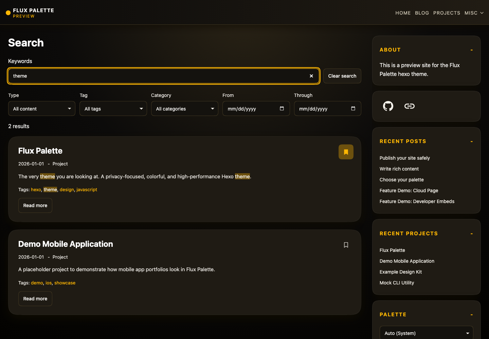
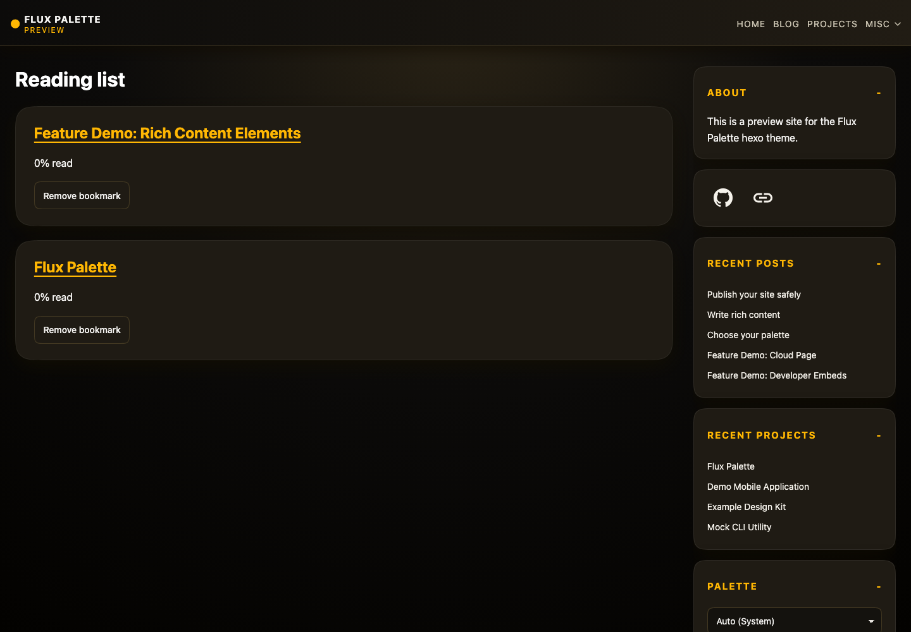

# Flux Palette

A [Hexo](https://hexo.io/) theme with multiple color palettes, rich Markdown, encrypted articles, and a project portfolio.

[Live demo](https://flux-palette.louist.dev/) · [Repository](https://github.com/LouisT/hexo-theme-flux-palette)

- Built-in palettes and a custom-color generator.
- Posts, projects, article series, and featured homepage content.
- Local or hosted search, RSS/Atom feeds, and a category/tag explorer.
- Bookmarks, reading preferences, responsive images, and optional offline downloads.

[Installation](#installation) · [Configuration](#configuration) · [Writing](#writing-content) · [Search](#search)

<!-- screenshots:start -->
## Screenshots

Main demo pages. Regenerate from the demo repository root:

```bash
npm run gen-screenshots
```

Add `-- --full-page` for full-height captures.

| | |
| --- | --- |
| **Homepage**<br> | **Blog**<br> |
| **Projects**<br> | **Project details**<br> |
| **Blog post**<br> | **Topic cloud**<br> |
| **Search**<br> | **Reading list**<br> |

<!-- screenshots:end -->

## Installation

Requires Node.js 20.19 or newer. From your Hexo site's directory:

```bash
git clone --depth=1 https://github.com/LouisT/hexo-theme-flux-palette.git themes/flux-palette
npm ci --prefix themes/flux-palette --include=optional
```

Set these values in your site's main `_config.yml`:

```yml
theme: flux-palette
syntax_highlighter: highlight.js
highlight:
  auto_detect: false
  line_number: true
  wrap: true
  hljs: false # Required for the theme's code styles.
```

Copy the bundled [configuration example](examples/_config.flux-palette.yml) into your Hexo site root, beside the main `_config.yml`:

```bash
cp -n themes/flux-palette/examples/_config.flux-palette.yml _config.flux-palette.yml
```

The example uses local search without credentials and leaves comments disabled until you configure your own repository. `cp -n` preserves an existing file; merge the example settings into your existing config when needed.

Hexo merges the site-root copy over the [shipped defaults](_config.yml). Add your preferences without a `theme_config:` wrapper. Existing `theme_config` values take priority, so remove duplicates when migrating. Keep general Hexo settings and social links in the main site config. Files under `themes/flux-palette/examples/` are templates; edit the copies in your site root to configure the site.

```bash
npx hexo generate
npx hexo server
```

For production installs, add `--omit=dev` to the theme's `npm ci` command. Set `swc.enabled: false` if the optional SWC package is unavailable.

## Configuration

Unless labeled otherwise, configuration examples belong in the site's `_config.flux-palette.yml`. The [annotated example](examples/_config.flux-palette.yml) provides a starting configuration and environment references for every search provider. See the [defaults](_config.yml) for the full option list.

### Environment variables

Local search needs no `.env` file. For remote search or passwords supplied through environment variables, copy the bundled [environment example](examples/.env.example) from the Hexo site root:

```bash
cp -n themes/flux-palette/examples/.env.example .env
```

Select `search.service` in the site-root `_config.flux-palette.yml`, then fill in only that provider's variables in `.env`; the matching `env:VARIABLE` references are already present in the configuration example. Leave unused credentials blank. For [password-protected content](#password-protection), set `FLUX_POST_PASSWORD` and use `password: env:FLUX_POST_PASSWORD` in the article's front matter, or supply another named variable.

The theme automatically loads `.env` from the Hexo site root. Shell and CI variables take precedence. Restart Hexo after editing the file. `.env.example` contains placeholders; keep actual `.env` files out of Git. Add these entries to your site's `.gitignore`:

```gitignore
.env
.env.*
!.env.example
```

### Theme settings

| Setting | Purpose |
| --- | --- |
| `menu`, `sidebar` | Navigation, recent projects, and social buttons. |
| `sidebar.palette_selector` | Default palettes and optional `include` list; include both defaults. |
| `blog.per_page`, `projects.per_page` | Items per page; `0` shows all items. |
| `cloud` | Category/tag explorer, counts, sorting, and filtering. |
| `reading.enabled` | Bookmarks, reading preferences, and the `/reading/` library. |
| `read_time` | Reading-time estimates; optional writes to source front matter. |
| `related_content` | Related posts/projects and their display limit. |
| `heading_links`, `link_previews` | Copyable heading links and internal-link previews for HTML responses. |
| `images` | Local responsive variants; default widths 320-1280px and quality 80. |
| `embeds.enabled` | Require a click before loading supported external embeds. |
| `print.enabled` | Article print styles. |
| `feeds` | RSS, Atom, and sitemap output. |
| `content_freshness` | Explicit updated dates and optional stale-content notices. |
| `assets` | CSS minification, hashed filenames, and optional `_headers` cache rules. |
| `build.concurrency` | Shared image/SWC work limit, 1-8; automatic when omitted. |
| `build_cache.enabled` | Reuse unchanged work between builds. |
| `playground.enabled` | Generate a sample-content page at `/playground/`. |

The favicon follows the active palette by default. Set `favicon: /images/favicon.ico` for a custom icon, or `default_og_image: /images/social-card.png` for a default sharing image.

Internal link previews use small JSON metadata files generated only for destinations linked from Markdown posts or projects. Navigation, archives, ordinary-page bodies, and unreferenced pages do not create metadata files. For example, a post linking to `/posts/example/` uses `/link-previews/posts/example/index.json`. Eligible content links receive a `data-flux-preview` URL; hovering fetches and caches only that JSON, without requesting the target page. Queries, fragments, relative links, and subdirectory hosting resolve to the same preview. Protected targets expose only their public title and a generic protected-content summary. Links authored in protected bodies also generate public target metadata and initialize after unlocking. Downloads and known file links are excluded, and saved offline articles include their linked preview metadata and the fallback.

`/link-previews/default.json` supplies a generic preview when generated metadata is missing or invalid. Unresolved links require a successful HTML or XHTML `HEAD` response before using that fallback; attachments, unknown content types, and unsupported `HEAD` responses are skipped. Preview requests never fetch a target page's HTML body. The `link-previews/` output directory is reserved for generated metadata; disabling `link_previews.enabled` removes the preview annotations and JSON routes.

Use root-relative image paths such as `/images/photo.jpg`; the theme handles subdirectory hosting. Supported local images get responsive variants without upscaling. SVGs, animation, remote images, and authored responsive markup are preserved.

`assets.cache_headers: true` adds immutable caching rules for hashed assets. Keep HTML, catalogs, service workers, and stable asset aliases revalidating; hosts without `_headers` support need equivalent server settings.

## Writing content

Use standard Hexo front matter in `source/_posts/`:

```yml
---
title: My first post
date: 2026-01-01
tags: [hexo]
categories: [Notes]
cover: /images/banner.jpg
updated: 2026-02-01
comments: false
---
```

`cover` supplies the social-sharing image. `updated` shows an update date when later than publication; `comments: false` disables comments for that article.

### Password protection

Add this to a post or project's front matter:

```yml
password: env:FLUX_POST_PASSWORD
```

Set the variable in the build environment or the site's root `.env`. Bodies and images are encrypted with AES-256-GCM during generation; passwords are excluded from build output. Readers unlock content in the browser. **Lock again** and navigation clear decrypted content.

Titles, dates, taxonomy, and URLs remain public. Protected bodies stay out of public search, previews, feeds, persistent caches, offline downloads, and printed content. Images reused in public content remain public. Missing password variables or protected images fail the build.

### Content tags

Use these tags in Markdown. Alert types are `info`, `warning`, `danger`, `success`, and `tip`.

```markdown

Markdown content goes here.




First panel.


Second panel.





Expandable content.










Project milestone.





```

`gallery thumb:false` disables gallery thumbnails. Social buttons use the main site's `social` entries (`name`, `url`, and Iconify `icon`).

### Rich content elements

The theme provides twelve additional components. Block tags close with matching `end…` tags; options use `key:value` and quoted values can contain spaces. Keep content files in your site's `source/` directory, outside the theme. For the examples below, place comparison images at `source/images/rich-before.svg` and `source/images/rich-after.svg`, and the attachment at `source/downloads/rich-content-guide.txt`. The theme provides the generic `flux-sample.svg` illustration and generates separate samples for its optional playground.

```markdown
## Step-by-step guides



Select a palette in the sidebar. Each step accepts **Markdown**.


Preview your changes, then publish the generated site.



## Content cards



Try the theme's reading and content controls.


Keep articles you want to revisit in one place.



## Comparison tables


| Feature | Local | Hosted |
| --- | --- | --- |
| Credentials | None | Required |
| Offline support | Available | Connection required |


## Before and after



## Annotated code


const name = 'Reader';
console.log('Hello, ' + name);

This line prints the greeting. Copying the code excludes this explanation.



## Mermaid diagrams


flowchart LR
    Write --> Preview --> Publish


## Math equations

Inline math: a^2 + b^2 = c^2.


\sum_{i=1}^{n} i = \frac{n(n+1)}{2}


## Glossary popovers

A  can serve content quickly.

## Interactive checklists


- [ ] Review the article
- [ ] Check links and images
- [x] Choose a palette


## Figures and references

See  for a local image example.


A local figure with a **Markdown caption** and attribution.


## Download cards


A small text file you can keep next to your writing tools.


## Pros and cons



- Content stays in Markdown files.
- Components follow the selected palette.


- Interactive controls require JavaScript.
- Publishing changes requires a build.


```

Tracked guides and checklists need IDs unique within the article. Progress is saved in the current browser and resets when authored items change. Protected articles keep progress in memory only. Remove `track:true` for a static guide. Step icons are `info`, `check`, `code`, and `download`.

Cards use explicitly authored fields. Image comparisons require alternative text for both images. Comparison recommendations match one table header exactly. Code annotations follow the source code and use valid one-based line ranges; copying excludes annotations. Raw code, TeX, and diagram bodies preserve backslashes and template braces.

Mermaid is bundled locally and loads only when diagrams initialize. Math is generated as KaTeX HTML and MathML, with local styles and fonts; dollar-delimited text stays ordinary Markdown. Invalid equations and diagrams keep readable source fallbacks. Diagrams and equations are included in offline article downloads.

Figures require unique `id` values; `figure_ref` accepts the ID and resolves forward references. Only tagged figures receive numbers. Use `credit` and optional `credit_url` for attribution.

Local download cards infer format and size. External cards accept `format:PDF` and `size:"2 MiB"`; metadata is authored rather than fetched. **Files remain public even inside protected articles**, where cards display **Public file**. Downloadable attachments are not automatically saved for offline reading.

Both `download` and `image_compare` accept site-relative URLs such as `/downloads/report.pdf` and `/images/before.png`; these refer to `source/downloads/report.pdf` and `source/images/before.png`. The configured site root is added automatically. No files need to be added to the theme folder.

For files belonging to one article, use relative URLs. Enable `post_asset_folder: true` in the site's `_config.yml`, put a post's files beside `source/_posts/example.md` in `source/_posts/example/`, and use:

```markdown



A PDF stored with this article.

```

Projects use the same syntax with files in `source/_projects/example/` beside `source/_projects/example.md`; project asset folders do not require `post_asset_folder`. Public comparison images use the theme's responsive image processing. Attachments referenced by download cards are published as public files, including those in protected article asset folders.

### Media embeds

Use `` for YouTube, Spotify, Vimeo, Twitch, TikTok, Gist, JSFiddle, or CodeSandbox. IDs need a platform hint and, where relevant, a content type:

```markdown



```

Embeds load only after the reader clicks **Load**. Raw HTML embeds do not follow this policy; `embeds.enabled: false` restores immediate loading for supported tags.

### Projects

Add Markdown files under `source/_projects/`:

```yml
---
title: My app
date: 2026-01-01
weight: 100
featured: true
project_tags: [javascript, hexo]
project_category: Apps
project_status: Active
project_summary: A short description for the listing.
project_role: Design and development
project_stack: [Hexo, Alpine.js]
project_outcomes:
  - A readable portfolio
project_screenshots:
  - src: /images/overview.png
    alt: App homepage
    caption: Desktop overview
buttons:
  - name: GitHub
    url: https://github.com/LouisT/hexo-theme-flux-palette
---
```

Projects sort by weight, then date, descending. Filters use tags, category, and status before pagination. Optional case-study fields and screenshots are encrypted with the body when password protection is enabled; public taxonomy and status remain visible.

### Series and featured content

Add `series: getting-started` and a unique positive `series_order` to each chapter's front matter. Use `pinned: true` or a numeric pin priority for homepage articles, and `featured: true` for projects.

Each homepage section includes every pinned article or featured project. `pinned_limit` and `projects_limit` set how many cards are visible at once on desktop, with three by default; they do not cap the total. When more cards are available, left and right arrows scroll through the section and disable at either end. Articles follow pin priority, then date; featured projects follow weight, then date. On narrower screens, fewer cards appear at once. Readers can also swipe, scroll, or use the focused section's arrow, Home, and End keys. Every card remains available without JavaScript and in print.

```yml
home:
  mode: blog # blog or projects
  curated:
    enabled: true
    pinned_limit: 3
    projects_limit: 3
    topics:
      - label: Getting started
        url: /series/getting-started/
series:
  enabled: true
  items:
    getting-started:
      title: Getting started
      description: A practical guide to the theme.
```

Series generate `/series/` and `/series/<id>/` with chapter navigation. IDs must be lowercase slugs; duplicate chapter orders or route collisions fail the build.

Curated sections appear only on the homepage. Its blog feed shares the first `/blog/` page; later pages live under `/blog/page/<number>/`. `blog.per_page` overrides `index_generator.per_page`, then the main `per_page` setting. Post order follows `index_generator.order_by`.

## Search

Fresh installations use local search without credentials. All providers support posts/projects, tag/category filters, publication-date filters, and excerpts. `search.debounce` defaults to 3000 milliseconds.

For a remote provider, use `env:VARIABLE` references as shown below. The [configuration example](examples/_config.flux-palette.yml) and [environment example](examples/.env.example) include every provider's matching names; follow the [environment setup](#environment-variables) to create the site-root copies. Only the selected provider's variables are required. Write tokens stay in the build process; publishable keys and read-only tokens appear in the generated site. Use a database or index dedicated to public search data.

### Turso

Use a libSQL database with [FTS5 support](https://docs.turso.tech/features/sqlite-extensions). The theme creates and maintains the full-text index during generation. Create separate write and read-only tokens:

```bash
turso db tokens create <database-name>
turso db tokens create <database-name> --read-only
```

```yml
search:
  service: turso
  turso:
    url: env:TURSO_DATABASE_URL
    token: env:TURSO_AUTH_TOKEN
    read_token: env:TURSO_READ_ONLY_TOKEN
    table: flux_search
```

`url` accepts a `libsql://` URL or HTTPS origin. `table` is the prefix for theme-owned tables; use a different prefix for each site sharing a database.

### Upstash Redis

Create a Redis database in the [Upstash console](https://console.upstash.com/) and copy its REST URL, write token, and read-only token:

```yml
search:
  service: upstash
  upstash:
    url: env:UPSTASH_REDIS_REST_URL
    token: env:UPSTASH_REDIS_REST_TOKEN
    read_token: env:UPSTASH_REDIS_READ_ONLY_TOKEN
    index: flux
```

`index` is the prefix for Redis search keys. This provider is separate from Upstash Search.

### Upstash Search

Create an Upstash Search database and supply its separate REST URL and tokens:

```yml
search:
  service: upstash_search
  upstash_search:
    url: env:UPSTASH_SEARCH_REST_URL
    token: env:UPSTASH_SEARCH_REST_TOKEN
    read_token: env:UPSTASH_SEARCH_READ_ONLY_TOKEN
    index: flux
    max_results: 100
    semantic_weight: 0.75
    reranking: false
    input_enrichment: false
```

`max_results` accepts 1-1000 candidate chunks; results are deduplicated into articles, so the returned count can be lower. `semantic_weight` accepts 0-1. Reranking may add provider charges. Use a distinct index for each site.

### Supabase

Create a project and run this SQL in its SQL Editor. The default table prefix is `flux_search`; change both SQL and config if using another prefix.

```sql
CREATE TABLE flux_search_docs (
  id text PRIMARY KEY,
  title text,
  url text,
  date text,
  type text,
  excerpt text,
  encrypted boolean
);
CREATE TABLE flux_search_index (
  word text PRIMARY KEY,
  doc_ids text[]
);
ALTER TABLE flux_search_docs ENABLE ROW LEVEL SECURITY;
ALTER TABLE flux_search_index ENABLE ROW LEVEL SECURITY;
CREATE POLICY "Public read docs" ON flux_search_docs FOR SELECT TO public USING (true);
CREATE POLICY "Public read index" ON flux_search_index FOR SELECT TO public USING (true);
```

Supply the project URL, secret key, and publishable key:

```yml
search:
  service: supabase
  supabase:
    url: env:SUPABASE_URL
    sec_key: env:SUPABASE_SECRET_KEY
    pub_key: env:SUPABASE_PUBLISHABLE_KEY
    table: flux_search
```

### Indexing and recovery

Indexes upload during `hexo generate`. Failed Redis/Supabase uploads use local search by default; set `search.upload.fail_on_error: true` to require success, or `search.local_fallback: false` to omit fallback shards. `search.upload.timeout_ms` defaults to 15000 per request. Turso and Upstash Search always require successful indexing.

Publish only after a successful build. To resync an index after manual changes, clear caches with `npx hexo flux-cache-clear` and regenerate. Remote search requires connectivity and is not saved with offline articles.

## Comments

Comments are disabled by default. Get repository IDs from [giscus](https://giscus.app/) and enable it in the site theme config:

```yml
comments:
  enabled: true
  service: giscus
  sync_theme: true
  giscus:
    repo: username/repository
    repo_id: R_...
    category: General
    category_id: DIC_...
    mapping: pathname
    lang: en
```

For [Utterances](https://utteranc.es/), use `service: utterances` and set `utterances.repo`, `utterances.issue_term: pathname`, and `utterances.label: comments`. Widgets follow the selected light/dark palette; set `sync_theme: false` to use a fixed provider theme. Protected articles do not load comments.

## Offline reading

Enable reading tools and offline downloads together:

```yml
reading:
  enabled: true
offline:
  enabled: true
  max_articles: 50
  max_bytes: 52428800 # 50 MiB
```

Requires HTTPS or localhost. Readers explicitly choose **Save offline**, **Remove download**, or **Clear downloads** in `/reading/`. Only public articles and required local assets are saved; protected content, comments, remote search, and external embeds are excluded.

Failed saves and storage limits retain existing downloads. Files belong to one browser and origin, and browser storage clearing can remove them. Save an edited article again to refresh its copy; keep the site root stable.

## Development and updates

Run from the Hexo site's directory:

```bash
npm run format:check --prefix themes/flux-palette
npx hexo generate
npm run check --prefix themes/flux-palette -- --public ../../public --root /
```

The site checker validates links, fragments, and assets; pass your deployment subdirectory as `--root` when needed.

`npm run format --prefix themes/flux-palette` formats JS with Prettier, CSS with Biome, and EJS with JS Beautify. Append `:check` to individual `format:js`, `format:css`, or `format:ejs` scripts to check without writing.

JavaScript follows `scripts/project-generator.js`: four-space indentation, single quotes, semicolons, and grouped declarations for related values. Use focused single-line `//` comments above functions and complex statements, explaining their purpose without ending punctuation.

When updating, preserve the site's `_config.flux-palette.yml` and `.env`, reinstall dependencies from the new lockfile, and regenerate. Compare updated templates in `examples/` with your site-root copies and merge any settings you need. Move older custom settings out of the theme defaults or `theme_config` block first. If using the demo's `update-theme.sh`, follow its README for baseline checks and backups.

Flux Palette is [MIT licensed](LICENSE), by LouisT. Footer credit is controlled by `attribution`; its default link is [louist.dev/projects/flux-palette](https://louist.dev/projects/flux-palette/).
